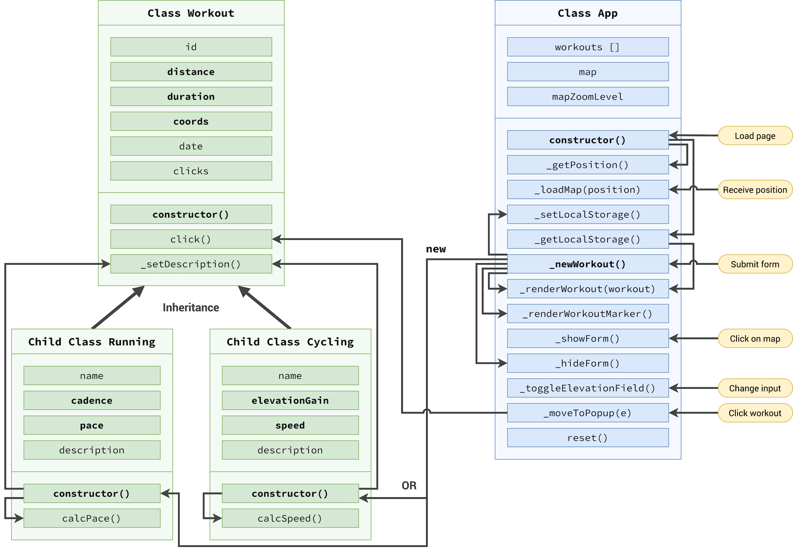

# MapOut App

## MapOut

MapOut is a location-based fitness app designed to help users track and mark their workout locations. Whether you are into cycling, running, or any other outdoor activity, MapOut allows you to document and visualize your fitness journey on a map.

---

# Flowchart

---

## Architecture

---

## Features

### 1. Track Workouts

MapOut enables you to track your workouts in real-time. Simply start the app, choose your activity (cycling, running, etc.), and let MapOut record your route, distance, and duration.

### 2. Mark Locations

Easily mark specific locations on your route that hold significance to you. Whether it's a great viewpoint, a challenging hill, or a favorite resting spot, MapOut lets you annotate your map with personalized markers.

### 3. Visualize Progress

Review your fitness progress over time by exploring your workout history. MapOut provides a visual representation of your routes and marked locations, allowing you to see how far you've come and the areas you frequent the most.

### 4. Share with Friends

Show off your achievements and favorite workout spots by sharing your maps with friends and the MapOut community. Encourage others to explore new routes and discover hidden gems in their surroundings.

## Getting Started

1. **Visit**

   Visit the [MapOut website](https://profound-cuchufli-398ba1.netlify.app/)

2. **Create an Account**

   Sign up for a MapOut account to access personalized features, save your workout history, and connect with other fitness enthusiasts.

3. **Set Permissions**

   Make sure to grant the app location permissions to accurately track your workouts and mark locations on the map.

4. **Start Mapping Out**

   Open MapOut, select your preferred activity, and start your workout. As you move, MapOut will capture your route, allowing you to mark locations along the way.

## Support and Feedback or connect

If you encounter any issues or have suggestions for improvement, please reach out to our support team at [X dm](https://twitter.com/roxonbluebirb). We value your feedback and are dedicated to making MapOut the best fitness companion for our users.

Happy mapping and exploring with MapOut! 🗺️🏃‍♂️🚴‍♀️
